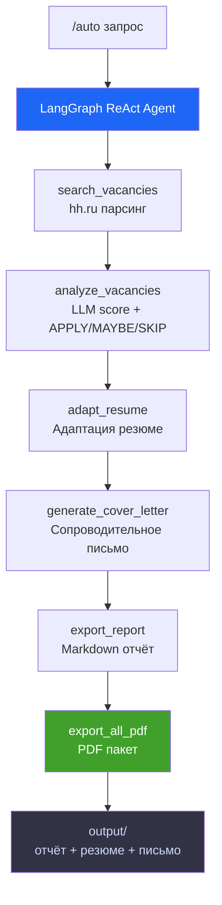

# AI Job Hunter Agent

> Автономный Python-агент для поиска AI-вакансий на hh.ru, анализа через LLM и адаптации резюме под каждую позицию.

**Автор:** Слава · [@ysiSevera](https://t.me/ysiSevera)  
**Стек:** Python 3.x · LangGraph · LangChain · OpenAI API · Streamlit · BeautifulSoup · Pydantic · fpdf2


---

## Что умеет агент

### Автономный режим `/auto` (рекомендуется)

Одна команда — полный цикл без участия человека:

```
agent> /auto prompt engineer
```

Агент (LangGraph ReAct) самостоятельно:
1. Ищет вакансии на hh.ru
2. Анализирует их через LLM (score 0–100, APPLY/MAYBE/SKIP)
3. Адаптирует резюме под лучшую вакансию
4. Генерирует сопроводительное письмо
5. Создаёт итоговый Markdown-отчёт
6. Экспортирует **PDF-пакет** (отчёт + резюме + письмо)

### Ручные команды CLI

| Команда | Что делает |
|---------|-----------|
| `/search` | Парсит hh.ru по запросам выбранной профессии |
| `/analyze [N]` | Анализирует N вакансий: score 0–100, APPLY / MAYBE / SKIP |
| `/adapt N` | Адаптирует резюме под конкретную вакансию |
| `/cover N [тон]` | Сопроводительное письмо (professional / friendly / concise) |
| `/resume N` | Экспортирует адаптированное резюме в Markdown и PDF |
| `/report` | Создаёт Markdown-отчёт по всем проанализированным вакансиям |
| `/open N` | Открывает вакансию в браузере |
| `/list [фильтр]` | Список вакансий: `apply`, `maybe`, `skip`, `top5`, `all` |

---

## Архитектура

```
ai_job_hunter/
├── app.py                      # Streamlit веб-интерфейс
├── agent.py                    # CLI-интерфейс, точка входа, все команды
├── config.py                   # Настройки, загрузка .env
├── run.bat                     # Запуск CLI (двойной клик)
├── run_web.bat                 # Запуск веб-интерфейса (двойной клик)
├── memory/
│   └── base_resume.json        # Долгосрочная память — базовое резюме v2.0
├── modules/
│   ├── autonomous_agent.py     # LangGraph ReAct-агент (/auto)
│   ├── tools.py                # 7 LangChain @tool инструментов
│   ├── searcher.py             # Парсинг hh.ru, фильтрация
│   ├── analyzer.py             # Анализ вакансий через LLM, скоринг
│   ├── resume_adapter.py       # Адаптация резюме под вакансию
│   ├── cover_letter.py         # Генерация сопроводительных писем
│   └── exporter.py             # Экспорт в Markdown + PDF (3 типа)
├── tests/
│   ├── test_searcher.py
│   └── test_evaluator.py
├── output/                     # Результаты работы агента (gitignored)
├── .env.example
└── requirements.txt
```

### Как это работает (автономный режим)



---

## Быстрый старт

### 1. Клонируй репозиторий

```bash
git clone https://github.com/slwvw1234-hue/ai_job_hunter.git
cd ai_job_hunter
```

### 2. Создай виртуальное окружение

```bash
python -m venv .venv

# Windows
.venv\Scripts\activate

# Linux / macOS
source .venv/bin/activate
```

### 3. Установи зависимости

```bash
pip install -r requirements.txt
```

### 4. Настрой `.env`

```bash
cp .env.example .env
```

Открой `.env` и заполни:

```env
OPENROUTER_API_KEY=sk-...   # OpenAI или OpenRouter ключ
LLM_MODEL=gpt-4o-mini       # Модель (gpt-4o-mini рекомендуется)
SEARCH_AREA=113              # 113 = вся Россия, 1 = Москва
RELEVANCE_THRESHOLD=45       # Минимальный score для отображения
PROFESSION_PRESET=AI/ML Engineer  # Пресет профессии (см. ниже)
```

Получить ключ OpenAI: [platform.openai.com/api-keys](https://platform.openai.com/api-keys)

> **Для пользователей из России:** если OpenAI недоступен напрямую, укажи прокси:
> ```env
> HTTPS_PROXY=http://127.0.0.1:10809
> ```

### 5. Заполни своё резюме

Открой `memory/base_resume.json` и замени данные на свои: имя, навыки, проекты, целевые роли.

### 6. Запусти агента

```bash
# Windows — двойной клик на run.bat (CLI) или run_web.bat (веб)

# CLI вручную:
python agent.py

# Веб-интерфейс вручную:
streamlit run app.py
# Открой http://localhost:8501
```

---

## Docker

```bash
# Сборка образа
docker build -t ai-job-hunter .

# Запуск (передаём ключ через env)
docker run -p 7860:7860 \
  -e OPENROUTER_API_KEY=sk-... \
  -e LLM_MODEL=gpt-4o-mini \
  ai-job-hunter
```

Открой [http://localhost:7860](http://localhost:7860)

---

## Пример сессии

```
agent> /auto prompt engineer

[AUTO AGENT] Запускаю автономный поиск: 'prompt engineer'
  [TOOL] search_vacancies → Найдено 31 вакансий
  [TOOL] analyze_vacancies → Прошли порог: 5 из 10
  [TOOL] adapt_resume → Резюме адаптировано под: AI Python Engineer
  [TOOL] generate_cover_letter → Письмо готово
  [TOOL] export_report → output/report_20260512_1638.md
  [TOOL] export_all_pdf → PDF-пакет готов:
      Отчёт:  output/report_20260512_1638.pdf
      Резюме: output/resume_ОООТД_ГраСС_20260512_1638.pdf
      Письмо: output/cover_ОООТД_ГраСС_20260512_1638.pdf

Топ-3 вакансии:
1. AI Python Engineer | Score: 45 | MAYBE
2. AI Engineer (ОТП Банк) | Score: 45 | MAYBE
3. Prompt Engineer (open-source LLM) | Score: 45 | MAYBE
```

---

## Настройки

### `.env` переменные

```env
OPENAI_API_KEY=sk-...        # OpenAI ключ
LLM_MODEL=gpt-4o-mini        # Модель (gpt-4o-mini рекомендуется)
SEARCH_AREA=113               # 113 = вся Россия, 1 = Москва
RELEVANCE_THRESHOLD=45        # Минимальный score для включения в отчёт
```

Получить ключ OpenAI: [platform.openai.com/api-keys](https://platform.openai.com/api-keys)

---

## Зависимости

| Библиотека | Назначение |
|------------|-----------|
| `langchain` + `langgraph` | ReAct-агент, @tool инструменты |
| `langchain-openai` | ChatOpenAI интеграция |
| `requests` + `urllib3` | HTTP-запросы |
| `beautifulsoup4` + `lxml` | Парсинг hh.ru |
| `pydantic` | Валидация и структуры данных |
| `python-dotenv` | Загрузка .env |
| `fpdf2` | Генерация PDF |
| `streamlit` | Веб-интерфейс |

---

## Roadmap

- [x] Парсинг hh.ru с фильтрацией Senior/мусора
- [x] Анализ через LLM (OpenAI)
- [x] Адаптация резюме под вакансию
- [x] Генерация сопроводительных писем
- [x] Экспорт в PDF (резюме + письмо + отчёт)
- [x] Streamlit веб-интерфейс
- [x] **LangGraph ReAct-агент (`/auto`) — полный цикл одной командой**
- [x] **7 LangChain @tool инструментов**
- [x] **PDF-пакет: три документа автоматически**
- [x] Парсинг Habr Career

---

## Этот проект как портфолио

Демонстрирует:

- **LangGraph / LangChain** — ReAct-агент, @tool инструменты, create_react_agent
- **Prompt Engineering** — многоэтапные промпты, JSON-first, anti-hallucination, управление температурой
- **LLM API** — OpenAI-совместимая интеграция, ChatOpenAI, структурированный вывод через Pydantic
- **Python** — модульная архитектура, Pydantic-валидация, веб-скрапинг, PDF-генерация
- **Системное мышление** — пайплайн поиск → анализ → адаптация → PDF-пакет

---

*Создан как портфолио-проект для поиска позиций Prompt Engineer / AI Engineer на российском рынке*
