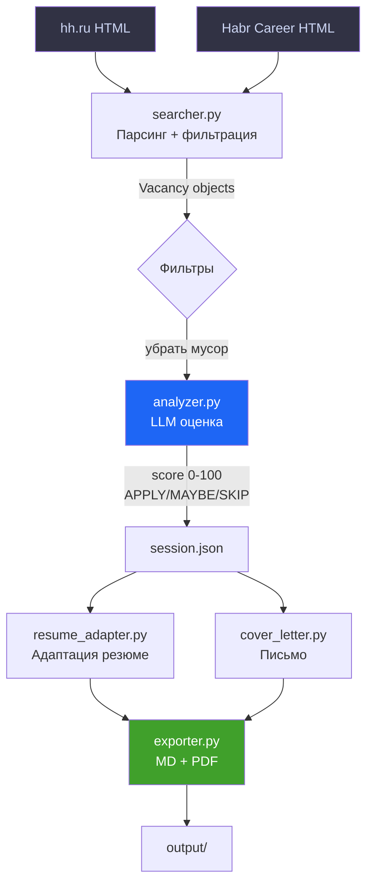

# AI Job Hunter Agent

> Автономный Python-агент для поиска AI-вакансий на hh.ru, анализа через LLM и адаптации резюме под каждую позицию.

**Автор:** Слава · [@ysiSevera](https://t.me/ysiSevera)  
**Стек:** Python 3.11 · OpenAI API · Streamlit · BeautifulSoup · Pydantic · fpdf2 · Docker


---

## Что умеет агент

| Команда | Что делает |
|---------|-----------|
| `/search` | Парсит **hh.ru и Habr Career** по запросам выбранной профессии, фильтрует мусор и Senior-вакансии, дедуплицирует |
| `/analyze [N]` | Анализирует N вакансий через LLM: score 0–100, APPLY / MAYBE / SKIP |
| `/adapt N` | Адаптирует резюме под конкретную вакансию (без придумывания фактов) |
| `/cover N [тон]` | Генерирует персонализированное сопроводительное письмо (professional / friendly / concise) |
| `/resume N` | Экспортирует адаптированное резюме в Markdown и PDF |
| `/report` | Создаёт общий Markdown-отчёт по всем проанализированным вакансиям |
| `/run [запрос]` | Полный цикл одной командой: search → analyze → report |
| `/open N` | Открывает вакансию в браузере |
| `/list [фильтр]` | Список вакансий: `apply`, `maybe`, `skip`, `top5`, `all` |

---

## Архитектура

```
ai_job_hunter/
├── app.py                # Streamlit веб-интерфейс (5 страниц)
├── agent.py              # CLI-интерфейс, точка входа, все команды
├── config.py             # Настройки, загрузка .env, пресеты профессий
├── Dockerfile            # Docker-образ для деплоя
├── run.bat               # Запуск CLI (двойной клик)
├── run_web.bat           # Запуск веб-интерфейса (двойной клик)
├── memory/
│   └── base_resume.json  # Долгосрочная память — базовое резюме кандидата
├── modules/
│   ├── searcher.py       # Парсинг hh.ru и Habr Career, фильтрация
│   ├── analyzer.py       # Анализ вакансий через LLM, скоринг
│   ├── resume_adapter.py # Адаптация резюме под вакансию
│   ├── cover_letter.py   # Генерация сопроводительных писем
│   ├── exporter.py       # Экспорт в Markdown / PDF
│   ├── evaluator.py      # Фидбэк и метрики качества рекомендаций
│   └── llm_client.py     # LLM клиент, fallback, exponential backoff
├── tests/
│   ├── test_searcher.py  # Тесты парсинга и фильтрации
│   └── test_evaluator.py # Тесты метрик
├── output/               # Результаты работы агента (gitignored)
├── .env.example          # Шаблон переменных окружения
└── requirements.txt
```

### Как это работает



---

## Быстрый старт

### 1. Клонируй репозиторий

```bash
git clone https://github.com/slwvw1234-hue/ai_job_hunter.git
cd ai_job_hunter
```

### 2. Создай виртуальное окружение

```bash
python -m venv .venv

# Windows
.venv\Scripts\activate

# Linux / macOS
source .venv/bin/activate
```

### 3. Установи зависимости

```bash
pip install -r requirements.txt
```

### 4. Настрой `.env`

```bash
cp .env.example .env
```

Открой `.env` и заполни:

```env
OPENROUTER_API_KEY=sk-...   # OpenAI или OpenRouter ключ
LLM_MODEL=gpt-4o-mini       # Модель (gpt-4o-mini рекомендуется)
SEARCH_AREA=113              # 113 = вся Россия, 1 = Москва
RELEVANCE_THRESHOLD=45       # Минимальный score для отображения
PROFESSION_PRESET=AI/ML Engineer  # Пресет профессии (см. ниже)
```

Получить ключ OpenAI: [platform.openai.com/api-keys](https://platform.openai.com/api-keys)

> **Для пользователей из России:** если OpenAI недоступен напрямую, укажи прокси:
> ```env
> HTTPS_PROXY=http://127.0.0.1:10809
> ```

### 5. Заполни своё резюме

Открой `memory/base_resume.json` и замени данные на свои: имя, навыки, проекты, целевые роли.

### 6. Запусти агента

```bash
# Windows — двойной клик на run.bat (CLI) или run_web.bat (веб)

# CLI вручную:
python agent.py

# Веб-интерфейс вручную:
streamlit run app.py
# Открой http://localhost:8501
```

---

## Docker

```bash
# Сборка образа
docker build -t ai-job-hunter .

# Запуск (передаём ключ через env)
docker run -p 7860:7860 \
  -e OPENROUTER_API_KEY=sk-... \
  -e LLM_MODEL=gpt-4o-mini \
  ai-job-hunter
```

Открой [http://localhost:7860](http://localhost:7860)

---

## Пример сессии

```
agent> /run
[ПОИСК] hh.ru по 11 запросам...
[ИТОГО] 87 уникальных вакансий

[АНАЛИЗ] 20 вакансий через gpt-4o-mini...
  Score: 78 | APPLY  — AI Automation Engineer
  Score: 71 | APPLY  — LLM/Agent Engineer
  Score: 65 | MAYBE  — ML-инженер в стартап
  ...

agent> /adapt 1
Адаптирую резюме под: AI Automation Engineer...

agent> /cover 1 friendly
Генерирую письмо (тон: friendly)...

agent> /resume 1
[PDF] output/resume_20260511_...pdf
```

---

## Настройки

### Пресеты профессий

В веб-интерфейсе выбирается прямо в UI. Для CLI — через `.env`:

```env
PROFESSION_PRESET=AI/ML Engineer   # по умолчанию
PROFESSION_PRESET=Python Developer
PROFESSION_PRESET=Data Analyst
PROFESSION_PRESET=Frontend Developer
```

Каждый пресет содержит 6–11 поисковых запросов под соответствующую профессию.
Добавить свой пресет можно в `config.py` → `PROFESSION_PRESETS`.

### Веб-интерфейс: страницы

| Страница | Что делает |
|----------|-----------|
| 🔍 Поиск | Поиск на hh.ru + Habr Career, фильтр по зарплате, скрыть виденные |
| 📊 Анализ | LLM-оценка вакансий, фильтр по APPLY/MAYBE/SKIP |
| 📝 Резюме и письма | Адаптация резюме, генерация письма, скачать PDF |
| 📄 Отчёт | Сводная статистика, скачать Markdown-отчёт |
| 📈 Оценка агента | Записывай реальные исходы, смотри Precision / Invite Rate / Accuracy |

---

## Зависимости

| Библиотека | Назначение |
|------------|-----------|
| `requests` + `urllib3` | HTTP-запросы, поддержка прокси |
| `beautifulsoup4` + `lxml` | Парсинг hh.ru и Habr Career |
| `pydantic` | Валидация и структуры данных |
| `python-dotenv` | Загрузка .env |
| `fpdf2` | Генерация PDF |
| `streamlit` | Веб-интерфейс |

---

## Roadmap

- [x] Парсинг hh.ru с фильтрацией Senior/мусора
- [x] Парсинг Habr Career
- [x] Анализ через LLM (OpenAI / OpenRouter)
- [x] Адаптация резюме под вакансию
- [x] Генерация сопроводительных писем
- [x] Экспорт в PDF
- [x] Сохранение сессии между запусками
- [x] Streamlit веб-интерфейс (5 страниц)
- [x] Docker-образ
- [x] Универсальный режим (4 пресета профессий)
- [x] Фильтр по зарплате
- [x] Дедупликация между сессиями
- [x] Evaluation pipeline (Precision, Invite Rate, Accuracy)
- [x] GitHub Actions CI (линтер + тесты)
- [x] Деплой на Hugging Face Spaces
- [ ] Демо-видео / GIF

---

## Этот проект как портфолио

Демонстрирует:

- **Prompt Engineering** — многоэтапные промпты, JSON-first, anti-hallucination, управление температурой
- **LLM API** — OpenAI-совместимая интеграция, exponential backoff при rate limit, fallback между моделями
- **Python** — модульная архитектура, Pydantic-валидация, веб-скрапинг
- **Системное мышление** — пайплайн поиск → фильтрация → анализ → адаптация → экспорт

---

*Создан как портфолио-проект для поиска позиций Prompt Engineer / AI Engineer на российском рынке*
